<div align="center">

# ✦ Distill — AI Text Summarizer

### Transform lengthy text into concise, meaningful summaries in seconds.

[](https://python.org)
[](https://pytorch.org)
[](https://huggingface.co/Md-Talha017/bart-samsum)
[](https://fastapi.tiangolo.com)
[](https://docker.com)
[](LICENSE)

<br/>

<kbd>

</kbd>

</div>

<br/>

---

<br/>

## 🎯 Overview

**Distill** is a production-ready text summarization system powered by [Facebook's BART](https://arxiv.org/abs/1910.13461) (Bidirectional and Auto-Regressive Transformer). It features a complete ML pipeline — from raw data ingestion through model training and evaluation — culminating in a sleek, dark-themed web interface served via FastAPI.

The fine-tuned model is hosted on **[Hugging Face Hub]([https://huggingface.co/Md-Talha017/bart-samsum](https://huggingface.co/spaces/Md-Talha017/text-summarizer))** (`Md-Talha017/bart-samsum`), enabling instant inference without local training.

<br/>

## ✨ Key Features

| Feature | Description |
|:---|:---|
| 🔗 **End-to-End Pipeline** | 5-stage automated workflow: Ingestion → Validation → Transformation → Training → Evaluation |
| 🤖 **BART Transformer** | Facebook's `bart-base` fine-tuned on the SAMSum dialogue summarization corpus |
| 🎛️ **Adjustable Length** | Choose between **Short**, **Medium**, and **Long** summary outputs |
| 🌐 **Modern Web UI** | Dark-themed, responsive interface with gold accent design system |
| ⚡ **FastAPI Backend** | High-performance async API with CORS, health checks, and auto-generated docs |
| 🐳 **Docker-Ready** | Single-command containerized deployment |
| 📊 **ROUGE Evaluation** | Automated ROUGE-1, ROUGE-2, and ROUGE-L metric tracking |
| 🏗️ **Modular Architecture** | Clean separation of concerns — components, pipelines, configs, and entities |

<br/>

## 🏗️ Architecture & Pipeline

```mermaid
flowchart LR
    subgraph Pipeline["⚙️ Training Pipeline"]
        direction LR
        A["📥 Data\nIngestion"] --> B["✅ Data\nValidation"]
        B --> C["🔄 Data\nTransformation"]
        C --> D["🧠 Model\nTraining"]
        D --> E["📊 Model\nEvaluation"]
    end

    subgraph Serving["🌐 Inference"]
        direction LR
        F["🤗 HuggingFace\nHub"] --> G["⚡ FastAPI\nServer"]
        G --> H["🖥️ Web UI /\nAPI"]
    end

    E -.->|"Push model"| F

    style Pipeline fill:#23211f,stroke:#d6c28a,stroke-width:2px,color:#f5f1ea
    style Serving fill:#23211f,stroke:#5a9e6e,stroke-width:2px,color:#f5f1ea
    style A fill:#2c2a27,stroke:#504b45,color:#f5f1ea
    style B fill:#2c2a27,stroke:#504b45,color:#f5f1ea
    style C fill:#2c2a27,stroke:#504b45,color:#f5f1ea
    style D fill:#2c2a27,stroke:#504b45,color:#f5f1ea
    style E fill:#2c2a27,stroke:#504b45,color:#f5f1ea
    style F fill:#2c2a27,stroke:#5a9e6e,color:#f5f1ea
    style G fill:#2c2a27,stroke:#5a9e6e,color:#f5f1ea
    style H fill:#2c2a27,stroke:#5a9e6e,color:#f5f1ea
```



<br/>

## 🛠️ Tech Stack

<table>
<tr>
<td width="50%">

### Core & ML
| | Technology |
|---|---|
| 🐍 | Python 3.11+ |
| 🔥 | PyTorch 2.5 |
| 🤗 | Transformers 4.41 |
| 📦 | Datasets (HF) |
| 🏎️ | Accelerate |

</td>
<td width="50%">

### Web & DevOps
| | Technology |
|---|---|
| ⚡ | FastAPI |
| 🦄 | Uvicorn (ASGI) |
| 📄 | Jinja2 Templates |
| 🐳 | Docker |
| 📐 | PyYAML Config |

</td>
</tr>
<tr>
<td>

### Evaluation
| | Technology |
|---|---|
| 📏 | ROUGE Score |
| 📊 | SacreBLEU |
| 📝 | NLTK |
| 🐼 | Pandas |

</td>
<td>

### Utilities
| | Technology |
|---|---|
| 📦 | python-box |
| 📂 | py7zr |
| 🔢 | NumPy |
| 📊 | tqdm |

</td>
</tr>
</table>

<br/>

## 📁 Project Structure

```
Text-Summarizer/
│
├── 📂 src/textSummarizer/          # Core package
│   ├── components/                 # Pipeline stage implementations
│   │   ├── data_ingestion.py       #   ↳ Download & extract datasets
│   │   ├── data_validation.py      #   ↳ Validate data integrity
│   │   ├── data_transformation.py  #   ↳ Tokenize with BART tokenizer
│   │   ├── model_trainer.py        #   ↳ Fine-tune BART-base
│   │   └── model_evaluation.py     #   ↳ ROUGE metric evaluation
│   ├── pipeline/                   # Orchestration layers
│   │   ├── stage_01..05_*.py       #   ↳ Training stage runners
│   │   └── prediction.py          #   ↳ Inference pipeline
│   ├── config/                     # Configuration manager
│   ├── entity/                     # Data classes / entities
│   ├── constants/                  # Path constants
│   ├── logging/                    # Custom logger
│   └── utils/                      # Helper functions
│
├── 📂 config/
│   └── config.yaml                 # Pipeline configuration
│
├── 📂 templates/
│   ├── index.html                  # Main web interface
│   └── predict.html                # Results page
│
├── 📂 research/                    # Jupyter notebooks (experimentation)
│   ├── 01..05_*.ipynb              #   ↳ Stage-by-stage prototyping
│   └── Text_Summarization.ipynb    #   ↳ End-to-end notebook
│
├── 📂 artifacts/                   # Generated outputs (git-ignored)
│   ├── data_ingestion/
│   ├── data_validation/
│   ├── data_transformation/
│   ├── model_trainer/
│   └── model_evaluation/
│
├── app.py                          # FastAPI application entry
├── main.py                         # Training pipeline entry
├── params.yaml                     # Training hyperparameters
├── requirements.txt                # Python dependencies
├── Dockerfile                      # Container configuration
├── setup.py                        # Package setup
└── LICENSE                         # MIT License
```

<br/>

## 🚀 Quick Start

### Prerequisites

- **Python 3.11+** · pip or conda
- **CUDA GPU** *(optional — recommended for training, not needed for inference)*
- **8 GB+ RAM** *(16 GB recommended for training)*

### 1 · Clone & Setup

```bash
git clone https://github.com/MdTalha17/TEXT-SUMMARIZER.git
cd TEXT-SUMMARIZER

# Create virtual environment
python -m venv venv

# Activate
venv\Scripts\activate        # Windows
source venv/bin/activate      # macOS / Linux

# Install dependencies
pip install -r requirements.txt
```

### 2 · Download NLTK Data

```python
import nltk
nltk.download('punkt')
nltk.download('stopwords')
```

### 3 · Run the Web App

```bash
python app.py
```

The app will start on **http://localhost:7860** — open it in your browser and start summarizing!

> **📝 Note:** On first launch, the BART model will be downloaded from Hugging Face Hub (~500 MB). Subsequent launches will use the cached version.

<br/>

## 🌐 API Reference

Once the server is running, interactive API docs are available at:
- **Swagger UI** → http://localhost:7860/docs
- **ReDoc** → http://localhost:7860/redoc

### Endpoints

<details>
<summary><code>GET /</code> — Web Interface</summary>

Returns the main HTML page with the text summarization form.
</details>

<details>
<summary><code>POST /predict</code> — Summarize Text</summary>

**Request:**
```bash
curl -X POST "http://localhost:7860/predict" \
  -H "Content-Type: application/x-www-form-urlencoded" \
  -d "text=Your text here&length=medium"
```

| Parameter | Type | Default | Description |
|-----------|------|---------|-------------|
| `text` | `string` | *required* | Text to summarize (max 4,000 chars) |
| `length` | `string` | `medium` | Summary length: `short`, `medium`, or `long` |

**Summary Length Mapping:**

| Length | Max Tokens | Min Tokens |
|--------|-----------|-----------|
| Short | 60 | 20 |
| Medium | 120 | 50 |
| Long | 180 | 80 |

</details>

<details>
<summary><code>GET /health</code> — Health Check</summary>

**Response:**
```json
{
  "status": "ok",
  "model_loaded": true
}
```
</details>

<br/>

## 🧠 Training Pipeline

Run the full 5-stage training pipeline:

```bash
python main.py
```

<details>
<summary>📋 <strong>Pipeline Stage Details</strong> (click to expand)</summary>

<br/>

| Stage | Component | Description |
|:---:|:---|:---|
| **1** | **Data Ingestion** | Downloads SAMSum dataset, extracts train/val/test splits |
| **2** | **Data Validation** | Verifies data integrity — checks for required files and formats |
| **3** | **Data Transformation** | Tokenizes dialogues and summaries using BART tokenizer |
| **4** | **Model Training** | Fine-tunes `facebook/bart-base` with configurable hyperparameters |
| **5** | **Model Evaluation** | Computes ROUGE-1, ROUGE-2, ROUGE-L metrics and saves results |

</details>

### ⚙️ Hyperparameters

Configured via `params.yaml`:

```yaml
TrainingArguments:
  num_train_epochs: 1
  warmup_steps: 500
  per_device_train_batch_size: 1
  per_device_eval_batch_size: 1
  weight_decay: 0.01
  gradient_accumulation_steps: 16
  fp16: False                       # Set True for mixed precision (GPU)
```

<br/>

## 📊 Evaluation

The model is evaluated using **ROUGE** (Recall-Oriented Understudy for Gisting Evaluation):

| Metric | What it measures |
|--------|-----------------|
| **ROUGE-1** | Overlap of unigrams (individual words) |
| **ROUGE-2** | Overlap of bigrams (word pairs) |
| **ROUGE-L** | Longest common subsequence |

Evaluation results are saved to `artifacts/model_evaluation/metrics.csv`.

<br/>

## 🐳 Docker Deployment

```bash
# Build
docker build -t distill-summarizer .

# Run
docker run -p 7860:7860 distill-summarizer
```

The container exposes port **7860** and starts the FastAPI server automatically.

<br/>

## 🗂️ Configuration

All pipeline paths and model configs are centralized in `config/config.yaml`:

<details>
<summary>📄 <strong>Full Configuration</strong></summary>

```yaml
artifacts_root: artifacts

data_ingestion:
  root_dir: artifacts/data_ingestion
  source_URL: https://github.com/MdTalha17/Datasets/raw/refs/heads/main/samsumdata.zip
  local_data_file: artifacts/data_ingestion/data.zip
  unzip_dir: artifacts/data_ingestion

data_validation:
  root_dir: artifacts/data_validation
  STATUS_FILE: artifacts/data_validation/status.txt
  ALL_REQUIRED_FILES: ["train", "test", "validation"]

data_transformation:
  root_dir: artifacts/data_transformation
  data_path: artifacts/data_ingestion/samsum_dataset
  tokenizer_name: facebook/bart-base

model_trainer:
  root_dir: artifacts/model_trainer
  data_path: artifacts/data_transformation/samsum_dataset
  model_ckpt: facebook/bart-base

model_evaluation:
  root_dir: artifacts/model_evaluation
  data_path: artifacts/data_transformation/samsum_dataset
  model_path: artifacts/model_trainer/bart-samsum-model
  tokenizer_path: artifacts/model_trainer/tokenizer
  metric_file_name: artifacts/model_evaluation/metrics.csv
```

</details>

<br/>

## 🤝 Contributing

Contributions, issues, and feature requests are welcome!

```
1. Fork the repository
2. Create your feature branch    →  git checkout -b feature/amazing-feature
3. Commit your changes           →  git commit -m "Add amazing feature"
4. Push to the branch            →  git push origin feature/amazing-feature
5. Open a Pull Request
```

<br/>

## 📚 References

| Resource | Link |
|----------|------|
| BART Paper | [Denoising Sequence-to-Sequence Pre-training](https://arxiv.org/abs/1910.13461) |
| Trained Model | [Md-Talha017/bart-samsum](https://huggingface.co/Md-Talha017/bart-samsum) |
| SAMSum Dataset | [samsung/samsum](https://huggingface.co/datasets/samsum) |
| Transformers Docs | [huggingface.co/transformers](https://huggingface.co/transformers/) |
| FastAPI Docs | [fastapi.tiangolo.com](https://fastapi.tiangolo.com/) |

<br/>

## 📄 License

This project is licensed under the **MIT License** — see the [LICENSE](LICENSE) file for details.

<br/>

<div align="center">

## 👤 Author

**Mohd Talha**

[](https://github.com/MdTalha17)
[](mailto:talhamoh017@gmail.com)

---

<sub>If you found this project useful, consider giving it a ⭐ — it means a lot!</sub>

</div>
